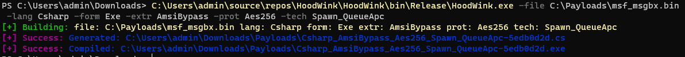

# HoodWink
A Modular project for loading "fun" code

### Overview
Currently
- HoodWink will take in shellcode and encrypt it
- Generate a loader using a given language and technique(s) to execute the shellcode
  - Techniques include things like spawn/queue apc injection and amsi bypass
- More modules and languages can easily be added by inheriting from base classes
- Still a work in progress with lots to do :)

Later versions will include more options for encryption, injection, languages, and more

<details>
<summary>Click to see futute options </summary>

More injection techniques
- Process Hollow
- Thread Hijack
- ...

Extras
- PPID Spoofing
- BlockDlls
- Module Stomping
- ...

Do above with
- both shellcode and dlls
- kernel32 and ntdll.dll (direct syscalls)
- In other languages (Nim, Rust, Python, ...)
</details>

#### Install
1. Clone into Visual Studio
2. Change path variable in Services/PathService.cs

Requires
- [clang for Visual Studio (clang-cl & lld-link)](https://learn.microsoft.com/en-us/cpp/build/clang-support-msbuild?view=msvc-170)
- [Nuget Package (Csharp Compiler)](https://www.nuget.org/packages/Microsoft.CodeDom.Providers.DotNetCompilerPlatform)
- [Cryptopp](https://www.cryptopp.com/)
	- [Guide for Building the Library](https://www.ired.team/miscellaneous-reversing-forensics/aes-encryption-example-using-cryptopp-.lib-in-visual-studio-c++)


#### Help Menu
```
Helper Flags:
    .\HoodWink.exe  -help         :  Show help menu for Flags
    .\HoodWink.exe  -langs        :  Show all Languages
    .\HoodWink.exe  -showall      :  Show all Modules
    .\HoodWink.exe  -show <lang>  :  Show Modules for lang
    .\HoodWink.exe  -descall      :  Show all Modules + Descriptions
    .\HoodWink.exe  -desc <lang>  :  Show Modules + Descriptions for lang

Syntax: Build Single
    .\HoodWink.exe -file <name> -lang <name> -form <name> -extr <name> -prot <name> -tech <name>

Syntax: Build all Techniques
    .\HoodWink.exe -file <name> -lang <name> -form <name> -extr <name> -prot <name> -tech All

Syntax: Build Everything
    .\HoodWink.exe -file <name> -genEvery

Example:
    .\HoodWink.exe -file C:\Payloads\msf.bin -lang Csharp -form Exe -extr AmsiBypass -prot Aes256 -tech Spawn_QueueApc
```

#### Usage Example


### Extras
<details>
<summary>Structure</summary>

Ha! Made you look

</details>


### About Contributers
<details>
<summary>Structure</summary>

They're all me, I have many accounts

</details>
